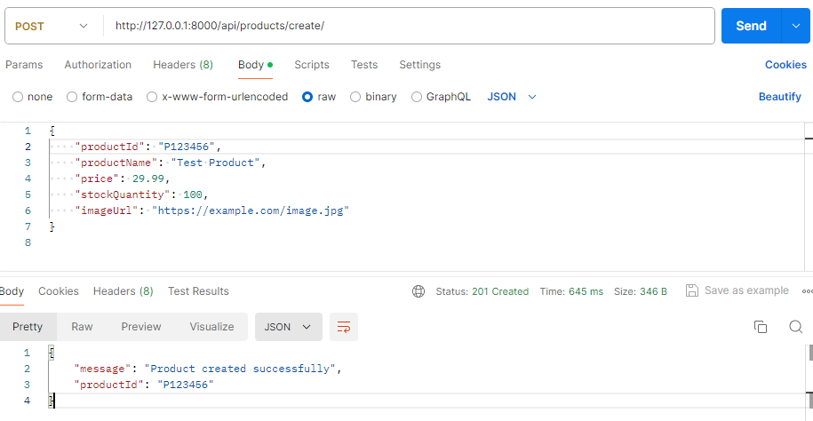
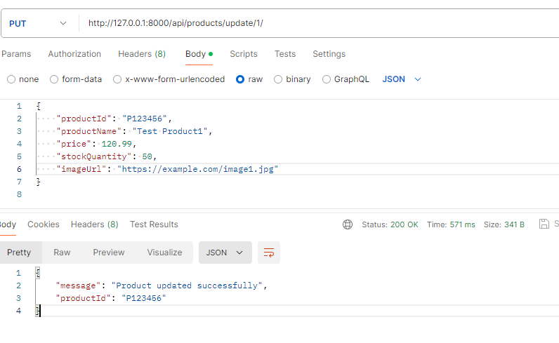
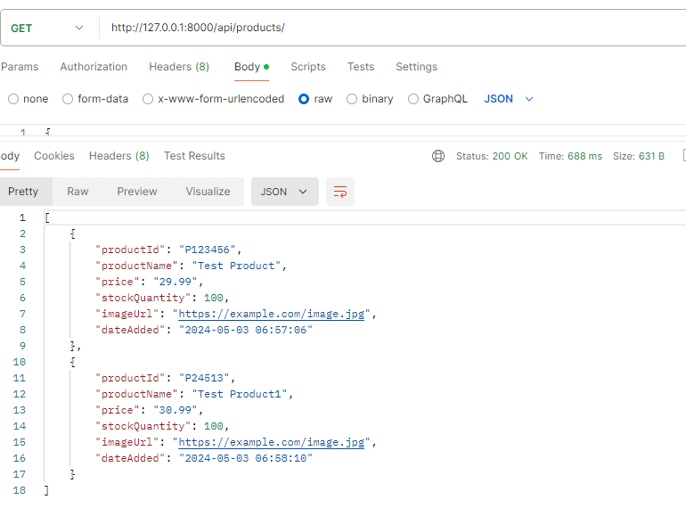
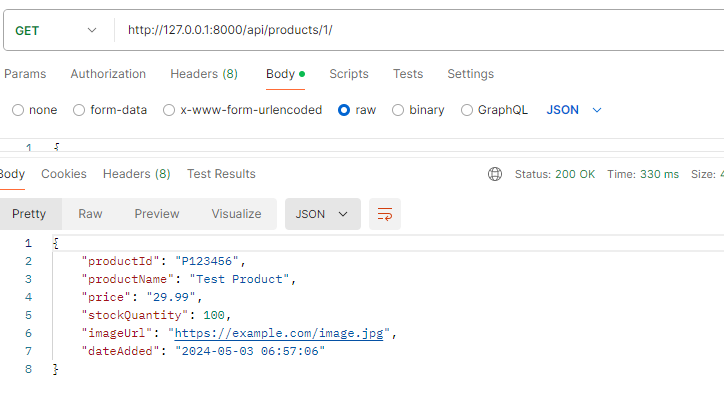
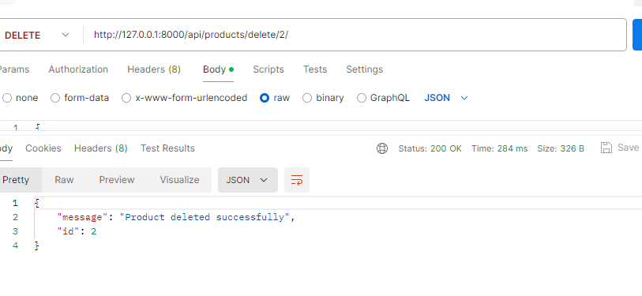

# E-commerce RESTful API

This project implements a RESTful API for managing products in an e-commerce application. 

<h2>Table of Contents</h2>
    <ul>
        <li>Introduction</strong></li>
        <li>Features</li>
        <li>Technologies Used</li>
        <li>Tool's Used</li>
        <li>Usage</li>
        <li>API Endpoints</li>
        <li>Screenshots</li>
    </ul>

<h2>Introduction</h2>

This project aims to provide functionalities to manage products in an e-commerce system through a RESTful API. It is built using Django, a high-level Python web framework.

<h2>Features</h2>
    <ul>
        <li>Retrieve a list of all products</li>
        <li>Retrieve details of a specific product by ID</li>
        <li>Create a new product</li>
        <li>Update an existing product</li>
        <li>Delete a product</li>
    </ul>

<h2>Technologies Used 👨🏽‍💻:</h2>
Python 
Django 
PostgreSql Database 
Django restframework api 

<h2>Tool's Used 👨🏽‍💻:</h2>
vscode (Local system) 
PGadmin4(Local system) 
Postman 

<h2>Usage</h2>
    
1. Start the development server:

    
python manage.py runserver

    
Access the API endpoints at http://localhost:8000/.

<h2>API Endpoints</h2>
    <ul>
        <li>GET /products: Retrieve a list of all products.</li>
        <li>GET /products/{id}: Retrieve details of a specific product by ID.</li>
        <li>POST /products: Create a new product.</li>
        <li>PUT /products/{id}: Update an existing product by ID.</li>
        <li>DELETE /products/{id}: Delete a product by ID.</li>
    </ul>

### Screenshots:

     
    
    
    
    

